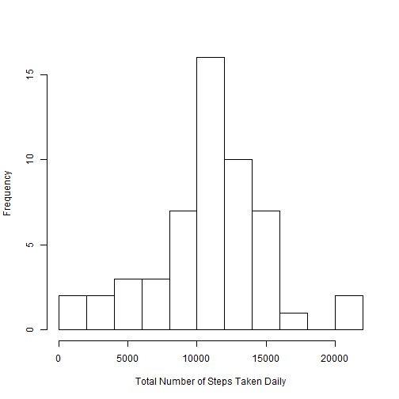

## Introduction
  This assignment makes use of data from a personal activity monitoring device. This device collects data at 5 minute 
  intervals through out the day. The data consists of two months of data from an anonymous individual collected during 
  the months of October and November, 2012 and include the number of steps taken in 5 minute intervals each day.

## Data
The data for this assignment can be downloaded from the course web site:
  Dataset: Activity monitoring data
The variables included in this dataset are:
  steps: Number of steps taking in a 5-minute interval (missing values are coded as NA)
date: The date on which the measurement was taken in YYYY-MM-DD format
interval: Identifier for the 5-minute interval in which measurement was taken
The dataset is stored in a comma-separated-value (CSV) file and there are a total of 17,568 observations in this dataset.

## Loading and preprocessing the data
1. Load the data (i.e. read.csv())


```r
library(ggplot2)
```

```
## 
## Attaching package: 'ggplot2'
```

```
## The following object is masked _by_ '.GlobalEnv':
## 
##     diamonds
```

```r
library(dplyr)
```

```
## 
## Attaching package: 'dplyr'
```

```
## The following objects are masked from 'package:arules':
## 
##     intersect, recode, setdiff, setequal, union
```

```
## The following objects are masked from 'package:stats':
## 
##     filter, lag
```

```
## The following objects are masked from 'package:base':
## 
##     intersect, setdiff, setequal, union
```


```r
library(lattice)

getwd()
```

```
## [1] "c:/"
```

```r
if(!file.exists("./data")){dir.create("./data")}
fileUrl<-"http://d396qusza40orc.cloudfront.net/repdata%2Fdata%2Factivity.zip"
download.file(fileUrl,destfile="./data/activity.zip", mode="wb")
unzip('./data/activity.zip', exdir='./data')

rdata <- read.csv("./data/activity.csv", header = TRUE, sep = ","
                 , colClasses = c("numeric", "character","integer"))
```


2. Process/transform the data (if necessary) into a format suitable for your analysis
We convert the date field to Date class and interval field to Factor class.


```r
rdata$date <- as.Date(rdata$date, format = "%Y-%m-%d")
rdata$interval <- as.factor(rdata$interval)
```

Let's take a look at the data


```r
str(rdata)
```

```
## 'data.frame':	17568 obs. of  3 variables:
##  $ steps   : num  NA NA NA NA NA NA NA NA NA NA ...
##  $ date    : Date, format: "2012-10-01" "2012-10-01" ...
##  $ interval: Factor w/ 288 levels "0","5","10","15",..: 1 2 3 4 5 6 7 8 9 10 ...
```


## What is mean total number of steps taken per day?
1. Calculate the total number of steps taken per day


```r
steps_per_day <- aggregate(steps ~ date, rdata, sum)
colnames(steps_per_day) <- c("date","steps")
head(steps_per_day)
```

```
##         date steps
## 1 2012-10-02   126
## 2 2012-10-03 11352
## 3 2012-10-04 12116
## 4 2012-10-05 13294
## 5 2012-10-06 15420
## 6 2012-10-07 11015
```

2. Make a histogram of the total number of steps taken each day


```r
hist(steps_per_day$steps, 
main=" ",
breaks=10,
xlab="Total Number of Steps Taken Daily")
```




3. Calculate and report the mean and median of the total number of steps taken per day


```r
steps_mean   <- mean(steps_per_day$steps, na.rm=TRUE)
steps_median <- median(steps_per_day$steps, na.rm=TRUE)
```
The mean and the median of the total number of steps taken per day are 1.0766189 &times; 10<sup>4</sup> 
and 1.0765 &times; 10<sup>4</sup>.

## What is the average daily activity pattern?


```r
steps_per_interval <- aggregate(rdata$steps, by = list(interval = rdata$interval), FUN=mean, na.rm=TRUE)
colnames(steps_per_interval) <- c("interval","steps")
```


1. Make a time series plot (i.e. type = "l") of the 5-minute interval (x-axis) and the average number of steps taken, 
averaged across all days (y-axis)


```r
plot(as.numeric(as.character(steps_per_interval$interval)),steps_per_interval$steps, type="l", xlab="Interval", 
ylab="Number of Steps",main="Average Number of Steps per Day by Interval")
lines(as.numeric(as.character(steps_per_interval$interval)),steps_per_interval$steps, type="l")
```


 

2. Which 5-minute interval, on average across all the days in the dataset, contains the maximum number of steps?


```r
max_interval <- steps_per_interval$interval[steps_per_interval$steps==max(steps_per_interval$steps)]
```
The 5-minute interval which contains on average the maximum number of step is the 835th.

## Imputing missing values
1. Calculate and report the total number of missing values in the dataset (i.e. the total number of rows with NAs)


```r
missing_vals <- sum(is.na(rdata$steps))
```
The number of missing values is 2304.
2. Devise a strategy for filling in all of the missing values in the dataset. The strategy does not need to be sophisticated. 
For example, you could use the mean/median for that day, or the mean for that 5-minute interval, etc.


```r
newdata <- rdata
which <- is.na(newdata$steps)
newdata$steps[which] <- steps_per_interval$steps[steps_per_interval$interval == newdata$interval[which]]
```
Unfortunately some intervals are still NA over the day. For those we impute the mean over all non-NA data.


```r
newdata$steps[is.na(newdata$steps)] <- mean(rdata$steps, na.rm=TRUE)
```
3. Create a new dataset that is equal to the original dataset but with the missing data filled in.


```r
sum(is.na(newdata$steps))
```

```
## [1] 0
```

```
## [1] 0
```
4. Make a histogram of the total number of steps taken each day and Calculate and report the mean and 
median total number of steps taken per day. Do these values differ from the estimates from the first part of the assignment? 
What is the impact of imputing missing data on the estimates of the total daily number of steps?


```r
new_steps_per_day <- aggregate(steps ~ date, newdata, sum)
colnames(new_steps_per_day) <- c("date","steps")
```


```r
hist(new_steps_per_day$steps, 
main=" ",
breaks=10,
xlab="Total Number of Steps Taken Daily", border="blue")
hist(steps_per_day$steps, breaks=10, border="red", xlab="Number of Steps", add=T)
legend("topright", c("Imputed", "Non-imputed"), col=c("blue", "red"), lwd=10)
```


```r
steps_mean_new   <- mean(new_steps_per_day$steps, na.rm=TRUE)
steps_median_new <- median(new_steps_per_day$steps, na.rm=TRUE)
```
The new mean and the median of the total number of steps taken per day are 1.0766189 &times; 10<sup>4</sup> 
and 1.0766189 &times; 10<sup>4</sup>. The outliers are gone so the mean and the median are closer.

## Are there differences in activity patterns between weekdays and weekends?
1. Create a new factor variable in the dataset with two levels ??? “weekday” and “weekend” 
indicating whether a given date is a weekday or weekend day.


```r
newdata$weekdayType <- ifelse(weekdays(newdata$date) %in% c("hon1", "hon2"), 
"weekend", "weekday")

head(newdata)
```

```
##       steps       date interval weekdayType
## 1 1.7169811 2012-10-01        0     weekday
## 2 0.3396226 2012-10-01        5     weekday
## 3 0.1320755 2012-10-01       10     weekday
## 4 0.1509434 2012-10-01       15     weekday
## 5 0.0754717 2012-10-01       20     weekday
## 6 2.0943396 2012-10-01       25     weekday
```


2. Make a panel plot containing a time series plot (i.e. type = "l") of the 5-minute interval (x-axis) 
and the average number of steps taken, averaged across all weekday days or weekend days (y-axis).


```r
steps_by_interval_i <- aggregate(steps ~ interval + weekdayType, newdata, mean)

library(lattice)

xyplot(steps_by_interval_i$steps ~ 
as.numeric(as.character(steps_by_interval_i$interval))|steps_by_interval_i$weekdayType, main="Average Steps per Day by Interval",
xlab="Interval", ylab="Steps",layout=c(1,2), type="l")
```


The plot indicates that the person moves around more (or more active) during the weekend days.


